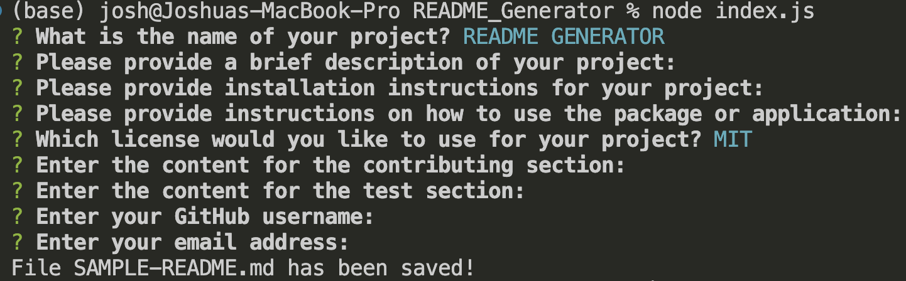

# Readme_Generator

## Description

This project is a README.md generator app that provides a wizard that walks the user through a serious of questions that are common on a professional readme. This project is designed for professional developers to allow a quick way to create a professional readme file so the developer can spend more time on writing code instead of writing a readme. How this project is ran is in the terminal with the command 'node index.js' and enter, once the project is ran the user will be walked through a serious of questions which will be rendered onto the readme doc. My most challenging moment of this project was learning to get all the functions working together and bringing the files together to work between one another as well as writing some of the functions, but once I overcame these challenges everything started to click.

## Table of Contents

- [Installation](#installation)
- [Usage](#usage)
- [Credits](#credits)
- [License](#license)

## Installation

In order for this application to run you must have node.js and npm installed on your computer, if you install node.js npm is automatically installed. If provided a clickable link below if you need to install node, the version that the application is using is 16.20.0.  
-[NodeJS](https://nodejs.org/en)

## Usage

Provide instructions and examples for use. Include screenshots as needed.
To use this app first navigate to the README_GENERATOR directory. Once inside the correct directory write the command "node index.js" and press enter, a wizard will pop up in your terminal with a serious of questions, an example screenshot is below of the code ran and the questioned asked, once you complete the wizard a message at the end will let you know the file has been saved as shown in the screenshot below.

## Credits

- Joshua V. Garcia

- [My GitHub Profile](https://github.com/garciajv86)

## License

The last section of a high-quality README file is the license. This lets other developers know what they can and cannot do with your project. If you need help choosing a license, refer to [https://choosealicense.com/](https://choosealicense.com/).

---

🏆 The previous sections are the bare minimum, and your project will ultimately determine the content of this document. You might also want to consider adding the following sections.

## Badges

Badges aren't necessary, per se, but they demonstrate street cred. Badges let other developers know that you know what you're doing. Check out the badges hosted by [shields.io](https://shields.io/). You may not understand what they all represent now, but you will in time.

## Features

If your project has a lot of features, list them here.

## How to Contribute

If you created an application or package and would like other developers to contribute it, you can include guidelines for how to do so. The [Contributor Covenant](https://www.contributor-covenant.org/) is an industry standard, but you can always write your own if you'd prefer.

## Tests

Go the extra mile and write tests for your application. Then provide examples on how to run them here.
